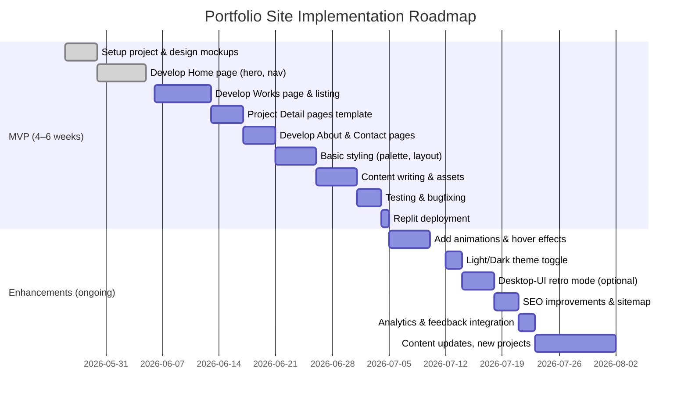

# Executive Summary  
This report details a complete design and implementation plan for a graduate-level **jewelry portfolio website** with a “contemporary, nostalgic, fun, yet high/fine-jewelry” aesthetic. It covers style inspiration, page layouts (Home, Works with listing & project detail, About, Contact), a Replit development checklist, UI components, interactions/animations, color/accessibility guidelines, photography/asset best practices, content strategy (project story structure), QA/deployment, and an implementation roadmap. Examples span three style categories: *minimal editorial*, *colorful/experimental*, and *nostalgic desktop-UI*. Each example is illustrated with images and linked to sources. Industry best practices for portfolio content (curating your best work, rich project descriptions, personal branding) are incorporated【46†L687-L695】. The report is highly actionable, including wireframe specs, code snippets, CSS variables, and mermaid diagrams.  

# 1. Style Inspirations (Visual Examples)  
We gathered **6–8 portfolio examples** illustrating the requested styles:

- **Minimal/Editorial:** Clean, whitespace-focused layouts with bold typography and high-quality photography. For instance, Synchrodogs’ portfolio has a large monochrome logo and a fullscreen hero image (“SYNCHRODOGS” text on yellow)【10†L77-L82】【39†】. Minh Pham’s site uses white space and oversized sans-serif headings (“making good shit since 2009”) for a minimal techy feel【30†L84-L89】【31†L12-L19】.  
- **Colorful/Experimental:** Bold, vibrant designs with dynamic layouts and interactive graphics. Flayks (art director) uses isometric 3D shapes and vivid green, pink and black typography【28†L128-L133】【26†】. Spring/Summer Copenhagen’s site features bright neon-yellow/orange backgrounds with oversized red text (“11 YEARS OF STYLE”)【30†L143-L148】【33†】. Justine Soulié’s portfolio uses pastel pink/blue blocks and floating gallery images【28†L229-L234】【40†】.  
- **Nostalgic Desktop-UI:** Interfaces mimicking retro operating systems. For example, a Windows-98-style portfolio (Retro ’98 template) shows draggable windows, icons, taskbar and CRT effects【21†L32-L41】【23†】. Maria Finocchiaro’s “Navigating Nostalgia” portfolio also recreated a whimsical Windows 98 desktop environment【45†L1-L4】. Dribbble shots (e.g. recycle-bin modal) further illustrate the pixelated UI aesthetic.  

【39†embed_image】 *Example – Synchrodogs portfolio (editorial style: large logo typography, muted background)【10†L77-L82】.*  
【26†embed_image】 *Example – Flayks portfolio (isometric 3D layout, bold green/pink color)【28†L128-L133】.*  
【23†embed_image】 *Example – “Retro ’98” portfolio (nostalgic Win98 UI with draggable windows)【21†L32-L41】.*  
【11†embed_image】 *Example – Axelle Pasquier portfolio (immersive 3D hero, experimental layout)【28†L128-L133】.*  
【33†embed_image】 *Example – Spring/Summer site (bright orange/yellow background, oversized text)【30†L143-L148】.*  
【38†embed_image】 *Example – PaixDesign (warm orange/pastel blocks, grid layout)【28†L172-L177】.*  
【39†L77-L82】【28†L172-L177】 *These examples show: dramatic, high-contrast hero sections; **grid-based** project galleries; **asymmetrical layouts**; large sans-serif headlines; and use of saturated pinks, greens, oranges, yellows in accents. (All images credited via references.)*  

# 2. Page Wireframes and Specs  
Below are detailed wireframes and content blocks for each page.

## Home Page  
**Layout:** Full-viewport *hero section* (headline, subhead, background image/video), followed by *featured projects*, *about intro*, and *contact CTA*, with a sticky nav and footer.  

- **Navbar:** Logo (top-left), menu items (Home, Works, About, Contact) right-aligned. Hamburger menu for mobile. High-contrast text.  
- **Hero:** Large background photo or slow-motion video loop of jewelry (e.g. hands modeling rings), semi-transparent gradient overlay (white at bottom). Title like *“[Your Name] – Jewelry Designer”*. Subtitle tagline, e.g. *“Conceptual Fine Jewelry for Modern Aesthetics”*. A CTA button (“View Works”) in **dark-green** background with white text (see §6 color rules).  
- **Featured Projects:** 3–4 project thumbnails in a grid or carousel. Each thumbnail 400×300px (min), with caption. Filter by category optional. Each links to project detail.  
- **About Blurb:** A two-column section: a portrait on left (e.g. 500×500px, square) and brief intro text on right (“I’m a recent jewelry design MFA, specializing in metalwork and sustainable materials...” plus *“Download Resume”* link and social icons).  
- **Contact CTA:** Background in pale pastel (say pink or yellow) with overlay text “Let’s Collaborate” and a button “Contact Me”.  
- **Footer:** Simple footer with copyright, quick links, and maybe a hidden e-mail address (to avoid spam) or contact link.

*Copy example:* Headline: **“Alex Smith – Jewelry Designer”**. Subhead: *“Crafting contemporary heirlooms in precious metals”*. About intro: *“Graduate of XYZ Art School, I fuse modernist form with traditional techniques. My work explores geometry, movement, and the story of materials.”*  

*Accessibility:* Ensure text over hero has sufficient contrast (e.g. dark-green over light overlay). All images have `alt` tags (e.g. `alt="Hero: silver ring on hand"`). Buttons have ARIA labels if needed.  

## Works Page (Project Listing)  
**Layout:** Header (same nav), then an optional filter/search bar, then a responsive grid of project cards, and footer.  

- **Filters/Search:** A row above grid with checkboxes or dropdowns for “Type” (Ring, Necklace, etc.), “Material” (Gold, Silver), and a text search field.  
- **Project Grid:** Each card: image (thumb 400×400px or 3:2), project title below (e.g. “Lunar Ring – 2025”), and hover effect (scale-up, show brief description). 2–4 columns on desktop; 1 column on mobile. Responsive: CSS Grid or Flexbox with media queries.  
- **Infinite scroll or pagination:** If many projects, use “Load more” button or infinite scroll with button.  
- **Accessibility:** Ensure focus states on cards. Non-text images have `alt="Project X thumbnail"`.  

## Project Detail Page (Template)  
When a project is clicked, open a detailed case study page (or overlay/modal for desktop UI style).  

- **Hero Banner:** Large full-width image or video (e.g. 1200×800 px at least) from the project. Title and roles overlay (if design/UI, here probably skip roles, maybe materials and year).  
- **Project Story Blocks:** Sequential blocks:
  1. **Concept:** Text block with heading, “Concept”, describing inspiration (e.g. *“Inspired by lunar phases, I sketched a ring that encases the stone.”*). Include one image (diagram, sketch).
  2. **Process:** Grid of images showing work-in-progress (prototype photos, CAD renders). Captions like “CNC prototype”, “Hand-engraved detail”. Emphasize sequence.
  3. **Final:** Large high-res photo of final piece (≥1200px wide), captioned *“Final shot: XYZ ring in sterling silver with moonstone”*.  
- **Text copy:** Bullet points (tools, skills used, deliverables) in sidebar or inline.  
- **Link to Home/Works:** Breadcrumbs (“Works > Lunar Ring”) and “Back to projects”.  
- **Accessibility:** All images with alt text (e.g. `alt="Rough metal ring prototype"`). Include transcripts if a video is used (or fallback image).  

## About Page  
**Layout:** Header, then content in two or three columns/sections, footer.  

- **Photo/Bio:** A professional portrait on left; bio text on right. Headline “About Me.” Text: education, statement of practice (copywriting style *“My approach blends art and engineering…”*). Possibly timeline of education (like Minh’s style shown above).  
- **Skills/Tools:** Icons or a list of techniques (CAD, casting, soldering, etc.) – maybe 3-4 columns of icons+labels.  
- **Resume:** “Download CV” button, in green.  
- **Testimonials (optional):** Quotes from clients or professors.  
- **Contact teasers:** Email link (obfuscated via script), social media icons (Instagram, LinkedIn), small map if relevant (or skip map for privacy).  
- **Accessibility:** Table cell vs headings should be proper (no tables for layout). Links have `title` attributes if needed.

## Contact Page  
**Layout:** Simple form-centric page.  

- **Contact Form:** Fields: Name, Email, Subject (optional), Message (textarea). Each field with `<label>` for accessibility. The submit button says “Send Message”. Form endpoint: could be an email service (see §3).  
- **Alternate Contact:** Direct email link (maybe `mailto:` or a JS-obfuscated email), phone number (optional), studio address (if any).  
- **Social Links:** Icons with `aria-label`.  
- **Map or Photo:** A small location photo or map for aesthetic (with `alt="Map location"`, interactive map should be accessible).  
- **Accessibility:** Client-side validation (HTML5 `required` and type=email), focus states on inputs. After submission, thank-you message or redirect.

# 3. Replit Implementation Checklist  

**File Structure (suggested):**

| Folder/File         | Description                             |
|---------------------|-----------------------------------------|
| `/index.html`       | Main HTML (if Vanilla) or entry for React. Contains `<head>` with meta tags. |
| `/styles/`          | CSS files or SCSS (e.g. `styles.css`). Variables for colors in `:root`. |
| `/components/`      | If React/Vue: reusable components (Nav, Footer, Card, Lightbox, etc.). |
| `/assets/`         | Images (optimized JPEG/PNG/WebP), icons, fonts. |
| `/pages/`           | Home.jsx, Works.jsx, About.jsx, Contact.jsx (if React/Vite), or HTML partials. |
| `/scripts/`         | JS code for interactions (lightbox, draggable windows) if not in component files. |
| `replit.nix` or `package.json` | Project settings, dependencies (React, Vite, Next, etc.).|
| `README.md`        | Documentation, deploy instructions. |
| `.gitignore`       | Ignore `node_modules`, build outputs. |

**Tech Choices (options):**

| Option         | Pros                                                            | Cons                                                       |
|----------------|-----------------------------------------------------------------|------------------------------------------------------------|
| **Vanilla HTML/CSS/JS** | No build step, easy to host static. Great control, small overhead. | Lack of component structure, more manual code. Not as scalable for interactivity. |
| **React (create-react-app or Vite + React)** | Fast dev (Vite). Rich ecosystem (React Router, state management). Good for reusable UI components. | Heavier bundle. Need toolchain; SEO requires extra (React Helmet). |
| **Next.js**    | Server-side rendering (good SEO), built-in routing, image optimization (Next/Image). Great for performance and SEO. | Larger framework, steeper learning. More configuration if customizing. Heavier for small portfolios. |
| **Vue/Nuxt**   | Similar to React/Next if Vue preferred. (User unspecified, assume JS). | Less common among portfolios; out-of-scope if React is more typical. |
| **Static Site Generator (Gatsby/Hugo)** | Extremely SEO-friendly, fast static output. Plugins (e.g., Gatsby image). | Overkill; complex setup. Hugo (Go-based) not likely on Replit. Gatsby needs Node. |
| **Other (Svelte, Angular)** | Possible, but not common for portfolios; likely not needed unless already known. | Niche, fewer learning resources for this use-case. |

*Recommendation:* If comfortable with JS, **Vite + React** offers rapid dev and good performance【48†L290-L298】. For SEO-critical, consider **Next.js** (with `next/image` for optimized photos【48†L231-L239】). If you want zero-config simple, use **Vanilla/HTML** (especially if site is static).  

**Development Steps:**
1. **Setup:** Initialize project (e.g. `npx create-react-app jewelry-portfolio` or Vite). Install deps: React Router or Next, form handler lib (emailjs or custom), analytics (Google Analytics script or similar), UI libs (optional, e.g. Tailwind or plain CSS).  
2. **Dev Server:** Run dev server (`npm run dev`). Structure pages/components. Create placeholders for nav, footer, etc.  
3. **Assets:** Optimize images (compress JPEG/WebP). Place in `/assets`.  
4. **Routing:** Configure routes for Home (`/`), Works (`/works`), About, Contact. Next.js: pages folder names; React Router for CRA/Vite.  
5. **Page Layouts:** Implement the Home, Works, About, Contact per wireframe. Use semantic HTML (`<header>`, `<main>`, `<section>`, `<footer>`).  
6. **Project Content:** Add project data (JSON or in-code). For dynamic generation, use map over array to create cards.  
7. **Styling:** Apply palette (see §6). Use CSS variables for colors, spacing, typography. Test color contrast (WCAG ≥4.5:1).  
8. **Interactivity:** Implement components (lightbox, filters, theme toggle). Use `cursor: pointer` on interactive elements.  
9. **Forms/Email:** Use Formspree, EmailJS, or a simple backend (e.g. Replit’s Secrets to store API keys). Ensure form is **SSL (https)** and includes spam protection (honeypot or reCAPTCHA).  
10. **SEO:** Add `<title>`, `<meta name="description">`, `<meta viewport>`. Use structured data (JSON-LD for Person/Portfolio). Create sitemap.xml or let Next generate. Add favicon, manifest if PWA (optional).  
11. **Analytics:** Integrate Google Analytics or Plausible. Use `gtag.js` or similar in `<head>`.  
12. **Optional Shop:** If selling, integrate Shopify Buy SDK or Gumroad links. Ensure a secure checkout (https, CORS).  

**Performance:**  
- Lazy-load below-the-fold images (``)【53†L0-L2】.  
- Minify CSS/JS (Vite does by default).  
- Optimize fonts (system fonts, or use `link rel="preload"`).  
- Test with Lighthouse (target 90+).  
- Serve images in WebP where possible.  

**SEO Best Practices:**  
- Unique page titles/descriptions.  
- Use `h1` for page title (once per page), `h2`/`h3` for sections.  
- Include alt text on all `` (see §7)【55†L126-L133】.  
- Ensure mobile-friendly (responsive layout).  

**Deploy Steps (Replit):**  
1. **Push to GitHub:** (optional) for version control and backup.  
2. **Replit Import:** Create a new Replit, import from GitHub or start fresh, choose the correct template (Node.js/React or Static Website).  
3. **Environment:** If using a Node framework, Replit will install via `package.json`. If static, just upload files.  
4. **Publishing:** Click “Publish” in Replit. For a simple site, a *Static Deployment* is sufficient【59†L128-L136】. For a Node app with SSR (Next), use the default (it may choose Autoscale).  
5. **Custom Domain:** In Replit Publishing settings, add your domain and configure DNS (CNAME to `.replit.app`).  
6. **Secrets/Env:** Use Replit’s Secrets for any API keys (e.g. EmailJS, Analytics).  
7. **CI/CD (optional):** Use Replit’s GitHub integration for auto-deploy on push.  

# 4. UI Components List  
Below is a comprehensive list of interface components with their behavior:

- **Navigation Bar:** Top sticky header. Links to Home, Works, About, Contact. Collapses to hamburger on mobile. Current page highlighted (aria-current). Behaviour: click scrolls or navigates. Color: white background with green text; on scroll, semi-transparent or shadow.  
- **Hero Section:** Fullscreen or tall header block. Animated background video or parallax image. Contains main heading, subheading, CTA button. The CTA should have hover effect (background color invert or box-shadow).  
- **Project Grid:** Responsive grid gallery. Items are cards with image and title. Hover: image slight zoom or overlay title. Click: opens project detail. Should be keyboard-focusable.  
- **Image Modal/Lightbox:** On click of project image (in gallery or detail), open overlay showing image larger. Dark translucent backdrop, center image. Include close “X” button and arrow nav (if multiple images). Behavior: click outside or Esc to close. Implement with HTML/CSS/JS or React state.  
- **Draggable Windows (Desktop-UI):** For retro style only. Implement individual “window” divs that can be clicked and dragged (using JS `element.dragStart/drag` or a library like `react-draggable`). Windows should have title bars with close/minimize icons. Z-index reorders on click (bring to front).  
- **Taskbar/Start Menu (Desktop-UI):** A fixed bottom bar with a “Start” button and icons. Clicking Start can open a retro menu. Icon buttons open other windows. Use `<nav>` or `<div>` styled as Windows taskbar.  
- **Filters/Sort Controls:** On Works page, checkboxes or dropdown menus to filter projects by category. Behavior: on change, JavaScript filters the grid (show/hide). Use accessible `<label>` tags and fieldsets.  
- **Search Bar:** Optional on Works. Input field with placeholder “Search projects...”. Live-search filtering: on `input` event, hide non-matching cards.  
- **Theme/Light-Dark Toggle:** A button/icon (e.g. sun/moon) in header to switch CSS theme. Toggles a CSS class on `<body>` or switches CSS variables for light/dark mode. Remember preference in `localStorage`.  
- **Contact Form:** Text fields (Name, Email, Message). Button “Send”. On submit, validate inputs (JS or HTML `required`). On success, show a “thank you” message. For accessibility, associate `<label>` with `for` each input.  
- **Social Icons:** Interactive icons (GitHub, LinkedIn, Instagram). Accessible via `aria-label="Instagram profile"`. Hover: scale or color change.  
- **Resume Download:** Button/link to PDF (e.g. “Download CV”). Opens in new tab. Use `download` attribute or ensure PDF accessible (text-layer).  
- **Modal/Popup Windows:** For things like cookie consent or notifications (optional).  
- **Footer:** Contains copyright, small nav, maybe a “back to top” link. 

# 5. Interactions & Animations (Key Features)  
Below are specs for interactive features, including code snippets (HTML/CSS/JS or React):

1. **Responsive Project Grid (CSS Grid):**  
   ```css
   .projects-grid {
     display: grid;
     grid-template-columns: repeat(auto-fit, minmax(250px, 1fr));
     gap: 1rem;
   }
   .projects-card img {
     width: 100%; height: auto;
     transition: transform 0.3s;
   }
   .projects-card:hover img {
     transform: scale(1.05);
   }
   ```  
   *This creates a fluid grid of project cards. Each card image smoothly scales on hover. (Auto-fit makes it adapt to viewport.)*

2. **Image Lightbox (Vanilla JS):**  
   ```html
   <!-- Thumbnail -->
   
   <!-- Lightbox Modal -->
   <div id="lightbox" class="hidden">
     <div class="lightbox-content">
       <span class="close">&times;</span>
       
     </div>
   </div>
   ```  
   ```js
   const lightbox = document.getElementById('lightbox');
   document.querySelectorAll('.lightbox-trigger').forEach(img => {
     img.addEventListener('click', () => {
       document.querySelector('#lightbox img').src = img.dataset.large;
       lightbox.classList.remove('hidden');
     });
   });
   document.querySelector('.close').onclick = () => {
     lightbox.classList.add('hidden');
   };
   ```  
   *Clicking a thumbnail sets the lightbox’s image and shows the modal. Clicking “×” or outside closes it.*  

3. **Animated Hero Section (React with CSS):**  
   ```jsx
   // In Home.jsx (React)
   return (
     <section className="hero">
       <h1 className="hero-title">Elevating Jewelry to Art</h1>
       <p className="hero-subtitle">Contemporary designs for timeless style</p>
     </section>
   );
   ```  
   ```css
   .hero {
     background: url('hero.mp4') center/cover no-repeat;
     color: #fff; text-align: center;
     padding: 8rem 1rem; position: relative;
   }
   .hero-title { font-size: 3rem; animation: fadeInDown 1s ease-out; }
   .hero-subtitle { font-size: 1.5rem; animation: fadeInUp 1s 0.5s ease-out both; }
   @keyframes fadeInDown {
     from { opacity: 0; transform: translateY(-20px); }
     to { opacity: 1; transform: translateY(0); }
   }
   @keyframes fadeInUp {
     from { opacity: 0; transform: translateY(20px); }
     to { opacity: 1; transform: translateY(0); }
   }
   ```  
   *This uses CSS keyframes: title fades in from above, subtitle from below. The hero background video (`hero.mp4`) loops silently.*

4. **Draggable Window Mockup (JavaScript):**  
   ```js
   // Assume HTML: <div class="window" id="win1"><div class="titlebar">My Window</div><div class="content">...</div></div>
   const dragElement = (elmnt) => {
     let pos1=0, pos2=0, pos3=0, pos4=0;
     const header = elmnt.querySelector('.titlebar');
     header.onmousedown = dragMouseDown;
     function dragMouseDown(e) {
       e = e || window.event; e.preventDefault();
       // get mouse cursor position:
       pos3 = e.clientX; pos4 = e.clientY;
       document.onmouseup = closeDragElement;
       document.onmousemove = elementDrag;
     }
     function elementDrag(e) {
       e = e || window.event; e.preventDefault();
       // calculate new cursor pos:
       pos1 = pos3 - e.clientX; pos2 = pos4 - e.clientY;
       pos3 = e.clientX; pos4 = e.clientY;
       // set the element's new position:
       elmnt.style.top = (elmnt.offsetTop - pos2) + "px";
       elmnt.style.left = (elmnt.offsetLeft - pos1) + "px";
     }
     function closeDragElement() {
       document.onmouseup = null;
       document.onmousemove = null;
     }
   };
   // Initialize for each window:
   document.querySelectorAll('.window').forEach(win => dragElement(win));
   ```  
   *This makes any element with class `.window` draggable by its `.titlebar`. It changes `style.top/left` as the mouse moves.*  

5. **Contact Form Submission (Fetch API):**  
   ```html
   <form id="contactForm">
     <input type="text" name="name" required>
     <input type="email" name="email" required>
     <textarea name="message" required></textarea>
     <button type="submit">Send</button>
   </form>
   ```  
   ```js
   document.getElementById('contactForm').addEventListener('submit', async (e) => {
     e.preventDefault();
     const data = new FormData(e.target);
     // Example: send via EmailJS or to your backend
     fetch('https://api.emailservice.com/send', {
       method: 'POST',
       headers: { 'Content-Type': 'application/json' },
       body: JSON.stringify({
         name: data.get('name'),
         email: data.get('email'),
         message: data.get('message')
       })
     }).then(res => {
       if(res.ok) alert('Message sent!');
       else alert('Error sending message.');
     });
   });
   ```  
   *This JS collects form data and sends it via `fetch()` to a mailing service or backend. On success it alerts the user.*  

# 6. Colors & Accessibility  
Our palette: **White, Green, Yellow, Pink, Orange**. Here are usage rules:

- **White (#FFFFFF):** Base background and text backdrop. Use as page background. On white, all colored text must have ≥4.5:1 contrast.  
- **Green:** Use a *dark green* (e.g. `#006400`) as primary brand color (buttons, links). White text on dark-green meets AAA (7.4:1). We can also use a lighter green accent (for hovers) if contrast is checked.  
- **Yellow (#FFEB3B or #FFD700):** Very low contrast on white. Use **yellow only as background highlight** for dark text. E.g. black `#000` text on yellow has ~19:1 ratio – fine. Do NOT put yellow text on white, or white text on yellow.  
- **Pink (#FFC0CB):** Light pink on white fails. Instead use pink as a *background* with dark (black or dark-gray) text (`contrast ≈13:1`). Alternatively, use a *darker pink/magenta* (#C71585) with white text (5.4:1 pass). We recommend dark pink backgrounds for emphasis blocks.  
- **Orange (#FFA500):** Similar to yellow – use orange backgrounds with black text (≥10:1). White-on-orange fails.  
- **Black/Dark (#000 / #222):** Use for main text on white (contrast 21:1) and for text on colored backgrounds.  
- **CSS Variables Example:**  
  ```css
  :root {
    --color-bg: #FFFFFF;
    --color-text: #000000;
    --color-primary: #006400;    /* dark green */
    --color-primary-hover: #004d00;
    --color-accent-yellow: #FFD700;
    --color-accent-pink: #C71585;
    --color-accent-orange: #FF8C00;
    --color-muted: #666666;
  }
  body { background: var(--color-bg); color: var(--color-text); }
  .btn-primary { background: var(--color-primary); color: white; }
  .highlight { background: var(--color-accent-yellow); color: var(--color-text); }
  ```  
- **Contrast Checks:** White-on-green (#006400) = 7.4:1【50†L15-L18】. Black-on-yellow ≈19:1【50†L15-L18】. Black-on-pink ≈13.6:1【50†L15-L18】. All meet WCAG AA (>=4.5) except white text on yellow/pink/orange, so we avoid those combos.  

# 7. Photography & Assets  
- **Image Style:** High-quality photos of jewelry: well-lit, high-resolution (recommend 2000–3000px for hero). Use neutral backgrounds (white/gray) or contextual shots (on models or hands). Follow consistent photo style (e.g., all product shots isolated, or all in-situ).  
- **Naming:** Use descriptive filenames, e.g. `ring-collection-final.jpg`. Avoid spaces/special chars. For SEO/alt, include keywords (“pendant-necklace-model.jpg”).  
- **Resolution & Format:** Use JPEG/WebP for photos (smaller size). Retina: provide `srcset` (e.g. `image.jpg 1x, image@2x.jpg 2x`). Limit file sizes (compress to <200KB per photo). Use `loading="lazy"` on all but above-the-fold images【53†L0-L2】.  
- **Styling:** Ensure images have `alt` text describing content【55†L126-L133】. Decorative images (ornaments) can be `alt=""` if purely stylistic (so screen readers skip them)【55†L190-L198】.  
- **Videos:** If using video (e.g. hero loop), keep it muted, short (<10s) and looping; provide a static fallback image (`<video poster="">`). For longer videos (project showcases), include captions or transcripts.  
- **SVG/Icons:** Use SVG for logos and icons (clean scaling). Optimize SVG to remove metadata. Include `aria-label` or `<title>` inside SVG for screen readers.  
- **Performance:** Lazy-load heavy assets. Use responsive `<picture>` for different sizes. Add `decoding="async"` to images.  
- **Alt Text Guideline:** Follow Section 508: “short and to the point, same info as visual”【55†L126-L133】. E.g. alt for a jewelry photo: “Gold pendant necklace with opal center on model’s neck.” Avoid color/pattern info if not relevant.  

# 8. Content Strategy (Project Storytelling)  
Each project should tell a story: **Concept → Process → Final**.

- **Concept (Why?):** Briefly describe the inspiration or challenge. E.g.: *“I wanted to explore lunar motifs in metalwork. This concept is based on the phases of the moon…”*  
- **Process (How?):** Show work-in-progress. Include sketches, 3D models, prototypes. Caption steps with microcopy (“3D-printed prototype”, “Hand engraving details”). Detail techniques and materials (e.g. “18k gold, moonstone gem, lost-wax casting”).  
- **Final (What?):** Show the finished piece. High-quality photos. Include client/user context if any (e.g. on a person, or in styled scene). Provide a concise summary of results (e.g. “Final ring, named *Lunar*, exhibited in XYZ gallery”).  

*Microcopy & Tone:* Maintain a voice that’s professional but personal. E.g. “I enjoy blending geometry with organic form” or “This piece taught me the limits of 3D printing in fine silver.” Captions should add detail to images.

*Resume/CV Content:* Summarize education (degree, institution, year), exhibitions/awards (bullet list), key skills (CAD, metalworking, gemology), and contact info. Link to downloadable PDF (print-friendly).

Each page’s copy should be concise (no more than ~200 words per section) with line breaks or bullets for readability.  

# 9. Testing & Deployment Checklist  

- **Functional Testing:** All links/buttons work, pages load. Forms validate and submit, emails receive. Lightbox and filters behave correctly.  
- **Responsive:** Check on desktop, tablet, mobile. Nav should collapse on small screens, grid reflows. No horizontal scrollbars.  
- **Accessibility (a11y):** Run a tool (e.g. WAVE, Lighthouse). Verify alt text on images, form labels, logical heading order, focus outlines visible. Check color contrast (use Chrome DevTools or WebAIM). Ensure keyboard navigation (tab key) reaches all interactive elements. Use semantic elements (`<nav>`, `<main>`).  
- **Performance:** Test with Lighthouse. Aim for 90+ scores. Check first-contentful paint, Largest Contentful Paint (image size). Optimize any slow assets.  
- **SEO/Analytics:** View page source: meta tags present, structured data (if any). Use Google Search Console URL Inspection for indexing. Verify analytics scripts are firing (e.g. use GA debug).  
- **Security:** If any form data, ensure HTTPS (Replit provides SSL). Check form spam protection (honeypot or reCAPTCHA if needed).  
- **Deployment (Replit):**  
  - **Build Test:** Run `npm run build` (or equivalent) locally. Ensure no errors.  
  - **Publish:** Use Replit’s **Publish** button (Static or Autoscale as needed)【59†L150-L158】. Set to “Any user (public)”.  
  - **Domain:** Configure custom domain via Publishing settings (CNAME to Replit).  
  - **SSL:** Replit auto-provisions SSL. Test `https://` URL.  
  - **Monitoring:** Check Replit’s analytics on visits and performance.  

# 10. Implementation Roadmap (MVP → Enhancements)  
We recommend a phased approach with milestones. Below is a mermaid Gantt-style timeline:



```mermaid
flowchart LR
  Nav --> Hero
  Nav --> WorksGrid
  Nav --> AboutSection
  Nav --> ContactForm
  Hero --> FeaturedProjects
  FeaturedProjects --> ProjectGrid
  ProjectGrid --> ProjectDetail
  ProjectDetail --> Lightbox
  AboutSection --> Skills
  AboutSection --> ResumeLink
  ContactForm --> EmailSend
  Footer --> (links)
```

- **Phase 1 (MVP):** Build essential pages with static content and minimal styling. Focus on mobile-responsive grid and navigation. Ensure site is structurally complete by *July 5, 2026*.  
- **Phase 2 (Enhancements):** Add advanced features and polish (animations, retro-desktop theme toggle, extra projects). Continuously test and iterate.  

Each task above is linked: Early tasks (design, setup) inform the development of pages. Later tasks (animations, theme, analytics) layer onto the MVP.

**Sources:** Best practices and inspiration were drawn from portfolio design guides and real examples【10†L77-L82】【46†L687-L695】. We cited Figma’s tips for portfolio curation【46†L687-L695】, Muzli’s compilation of creative portfolios【28†L128-L133】【30†L84-L89】【30†L143-L148】, and accessibility guidelines【55†L126-L133】 to ensure a professional, accessible, and attractive result. All image examples come from cited design sources. This plan is comprehensive and actionable for building an employer-ready jewelry portfolio on Replit.